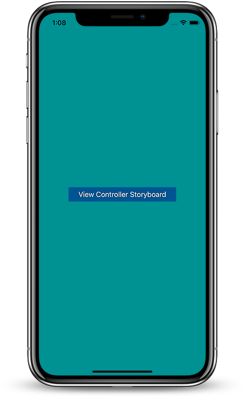

## StoryboardInitializable 

[![Swift Version][swift-image]][swift-url]

### Problem

#### A great advantage of using a storyboard with multiple views in it is that you can get a wholistic view of the app along with the navigation flow, but this has a major downside if you work with a team. 

- Source Control - endless merge conflicts on the storyboard, if each screen was kept seperate the number of conflicts would reduce. 
- Navigation - if the storyboard has multiple screens with navigation within the storyboard can become difficult or you might end up changing something unintentionally.
-  Storyboard Id - using storyboard ids can be error prone or lead to boilerplate code

## Solution - Use a single storyboard per screen :)
### Usage

Import 
```swift
import StoryboardInitializable

```

#### Basic usage if the name of the storyboard and the view controller is the same

```swift
let viewController = ViewControllerName.initFromStoryboard()
```

#### If the name of the view controller and the storyboard is different 

Override the storyboard name with the name you have given the storyboard
```Swift 
 static var storyboardName: String {
        return "NameOfYourStoryboard"
    }
```

Then load the view controller like earlier

```swift
let viewController = ViewControllerName.initFromStoryboard()
```


## Example

To run the example project, clone the repo, and run it in Xcode 10.

## Requirements

## Installation

### CocoaPods

CocoaPods is a dependency manager for Cocoa projects. For usage and installation instructions, visit their website. To integrate StoryboardInitializable into your Xcode project using CocoaPods, specify it in your Podfile:

```ruby
  pod 'StoryboardInitializable', '0.1.2'
```

## Meta

Pasan Mabotuwana – pasan@mabotuwana.com

[swift-image]: https://img.shields.io/badge/swift-4.2-orange.svg
[swift-url]: https://swift.org/